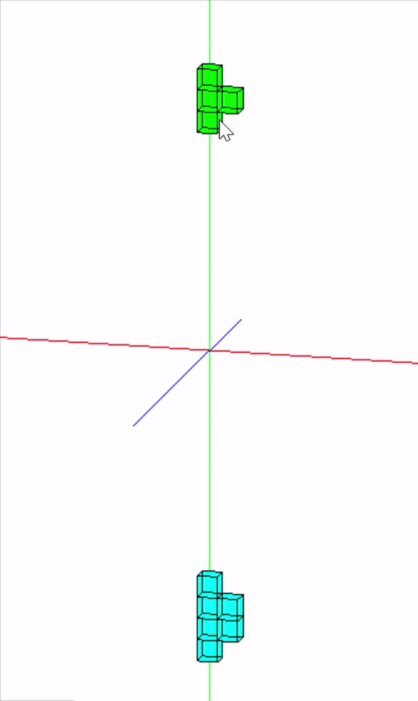
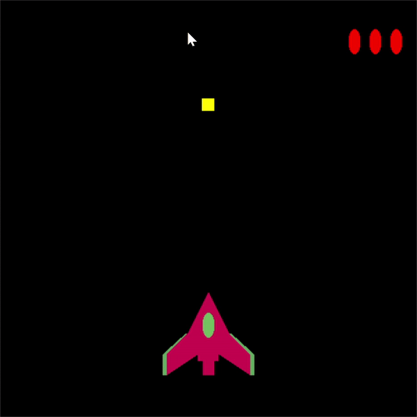

## Classic games

### Kind of games
- [Tetris](https://github.com/happyOBO/classic_games#tetris)
- [Galaga](https://github.com/happyOBO/classic_games#galaga)
### Tetris

---
### Contents
- 일반적인 테트리스 게임, 4가지의 도형중에 무작위로 한개가 위에서 아래로 떨어지며,
- 키보드 ``A``또는 ``D``를 누르면 도형을 좌우로 움직일 수 있다.
- ``Space bar``를 누르면 도형이 회전 가능하다.
- ``OpenGL`` , ``C++`` 사용
- **바닥에 도형이 쌓이는 구현 미흡하다.**
### 시연 영상

### Galaga

---
### Contents
- 비행물체를 움직여서 떨어지는 장애물을 피한다.
- 키보드 ``A``또는 ``D``를 누르면 비행물체를 좌우로 움직일 수 있다.
- 비행물체의 색상은 게임마다 바뀐다.
- 장애물을 맞을 때 마다 우측 상단의 빨간 공의 개수가 줄어들며, 빨간 공이 모두 사라지면 게임이 종료된다.
- ``OpenGL`` , ``C++`` 사용

### 시연 영상

