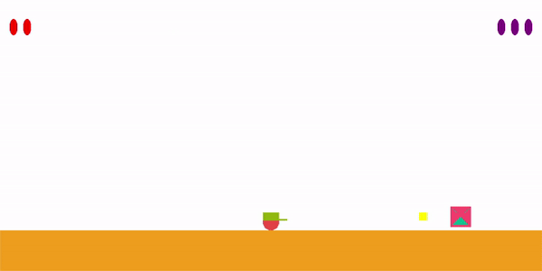
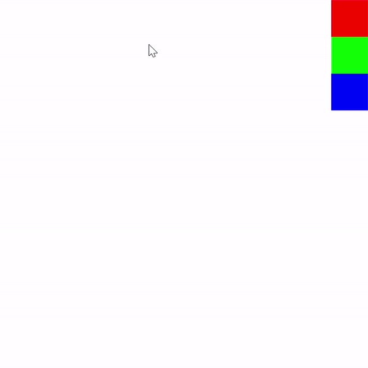
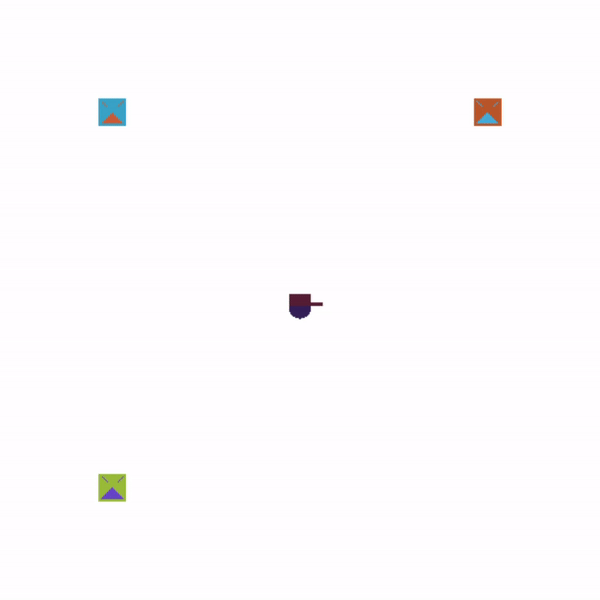
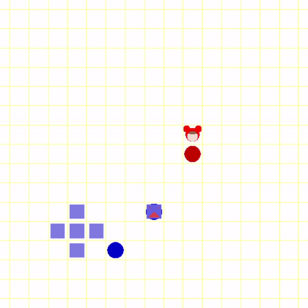

## Classic games

### Kind of games
- [Tetris](https://github.com/happyOBO/classic_games#tetris)
- [Galaga](https://github.com/happyOBO/classic_games#galaga)
- [Jump&Hit](https://github.com/happyOBO/classic_games#jump--hit)
- [Draw lines](https://github.com/happyOBO/classic_games#draw_lines)
- [Stone Roll](https://github.com/happyOBO/classic_games#stone_roll)

### Tetris

---
### Contents
- 일반적인 테트리스 게임, 4가지의 도형중에 무작위로 한개가 위에서 아래로 떨어지며,
- 키보드 ``A``또는 ``D``를 누르면 도형을 좌우로 움직일 수 있다.
- ``Space bar``를 누르면 도형이 회전 가능하다.
- ``OpenGL`` , ``C++`` 사용
- **바닥에 도형이 쌓이는 구현 미흡하다.**
### 시연 영상

### Galaga

---
### Contents
- 비행물체를 움직여서 떨어지는 장애물을 피한다.
- 키보드 ``A``또는 ``D``를 누르면 비행물체를 좌우로 움직일 수 있다.
- 비행물체의 색상은 게임마다 바뀐다.
- 장애물을 맞을 때 마다 우측 상단의 빨간 공의 개수가 줄어들며, 빨간 공이 모두 사라지면 게임이 종료된다.
- ``OpenGL`` , ``C++`` 사용

### 시연 영상

### Jump & Hit

---
### Contents
- 오른쪽 보스가 던지는 공을 점프를 통해 피하면서 보스를 잡는 게임.
- 키보드 ``A``또는 ``D``를 누르면 캐릭터를 좌우로 움직일 수 있다.
- 키보드 ``space bar``를 누르면 점프가 가능하다.
- 키보드 ``F``를 누르면 공을 던질 수 있다.
- 왼쪽 상단은 자신의 체력, 오른쪽 상단은 보스의 체력을 의미한다.
- 보스의 체력이 모두 없어지면 좀더 빠른 공을 던지며 체력이 높은 새로운 보스가 나타난다.
- 보스가 던지는 공을 맞을 때 마다 체력이 줄어들며 모두 사라지면 게임이 종료된다.
- ``OpenGL`` , ``C++`` 사용

### 시연 영상

### Draw_lines

---
### Contents
- 선 그리기
- 오른쪽 상단의 세가지 색(빨강, 초록, 파랑)중 하나를 클릭하여 해당 색의 곡선을 그릴 수 있다.

### 시연 영상

### Stone_Roll

---
### Contents
- 캐릭터는 ``A``,``D``,``W``,``S``키를 이용해 움직일수 있다.
- 돌(NPC) 근처에서 ``SPACEBAR``를 누를경우 돌(NPC)는 반대 방향으로 한칸 움직인다.
- ``NPC`` 클래스를 생성해 변수를 여러개 만들지 않고, 여러 돌들을 만들수 있다. 
- ``OpenGL`` , ``C++`` 사용

### 시연 영상

### Crazy Arcade

---

### Contents

- ``OpenGL``을 이용해 넥슨 사의 크레이지 아케이드 게임 만들기
- 캐릭터는 ``A``,``D``,``W``,``S``키를 이용해 움직일수 있다.
- ``SPACEBAR``를 누를 경우 최대 3개 물풍선을 놓을수 있고, 약 3초뒤에 주변에 물줄기를 나타내며 터진다.
- ``OpenGL`` , ``C++`` 사용

### 시연 영상

